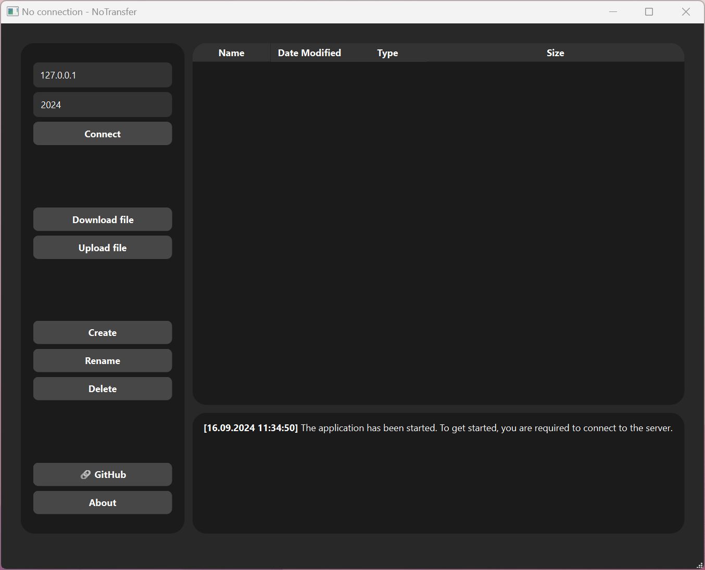

# NoTransfer
**NoTransfer** is a project that allows sharing access to local folders using a standalone server and client, both written in [Qt](https://www.qt.io/). It is designed for the **New Generation** course.

## Screenshots


## How to Build and Run
1. Open a terminal and clone the repository:
```bash
git clone https://github.com/hrebeniukde/NG_2024_NoTransfer.git
```
2. Open **Qt Creator**.
3. Click **File** -> **Open file or project** and select either the `Client.pro` file to open the client-side or the `Server.pro` file to open the server-side.
4. Configure the project according to the compilers installed on your system.
5. Click the Run button or press Ctrl+R to compile and launch the application.